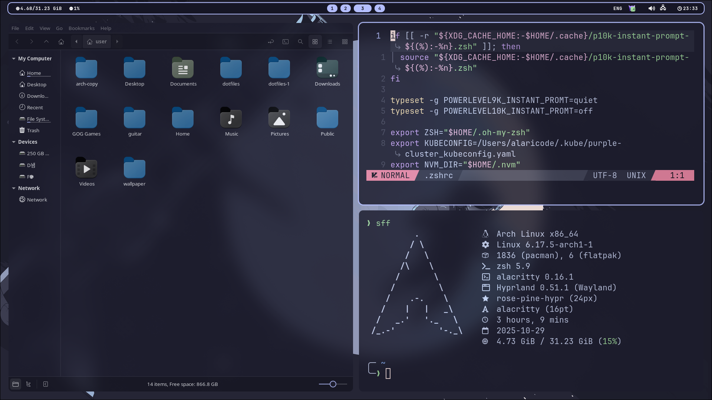

<h1 align="center"> :herb: Sakuyma hyprland Rice :herb: </h1>

<h1 align="left"> :blue_book: About</h1> 


</br>

 - OS: [**`Arch Linux`**](https://archlinux.org/)
 - WM: [**`Hyprland`**](https://github.com/hyprwm/Hyprland)
 - Bar: [**`Waybar`**](https://github.com/Alexays/Waybar)
 - Terminal: [**`Alacritty`**](https://github.com/alacritty/alacritty)
 - App Launcher: [**`Rofi`**](https://github.com/davatorium/rofi)
 - Notify Daemon: [**`Dunst`**](https://github.com/dunst-project/dunst)
 - Shell: [**`Zsh`**](https://github.com/zsh-users/zsh)

</br>
<h1 align="left"> 🖼️ Gallery </h1> 





## :wrench: INSTALLATION

> [!WARNING]
> **This installation script only works on Arch Linux.**
> **This Configuration is designed for 1920X1080 monitors, some functionality of the shell may not work as it should. In this case you need to make adjustments manually.**
> **If you find errors in the shell, please report the problem.**

### :bulb: STEPS

**1. install python3 and git:**

```bash
sudo pacman -S python3 git
```
**2. clone repo:**

```bash
cd /tmp
git clone https://github.com/sakuyma/dotfiles
cd dotfiles
```

**3. run installer:**

```bash
bash install.sh
```

## 💻 HotKeys
* **Open the terminal** - `super + q`
* **Set a random wallpaper** - `super + w`
* **Open the application menu** - `super + r`
* **Launch Telegram** - `super + t`
* **Close the window that is in focus** - `super + c`
* **Take a screenshot** - `print`
* **Take a screenshot of region** - `ctrl + print`
* **Take a screenshot of window** - `super + print`
* **Switch to another desktop** - `super + 1/10`
* **Move the window to another desktop** - `super + shift + 1/10`
* **Switch the window to floating mode** - `super + v`
* **Move window** - `super + alt + left/right/down/up`
