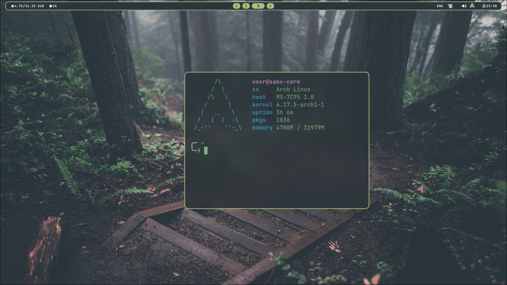
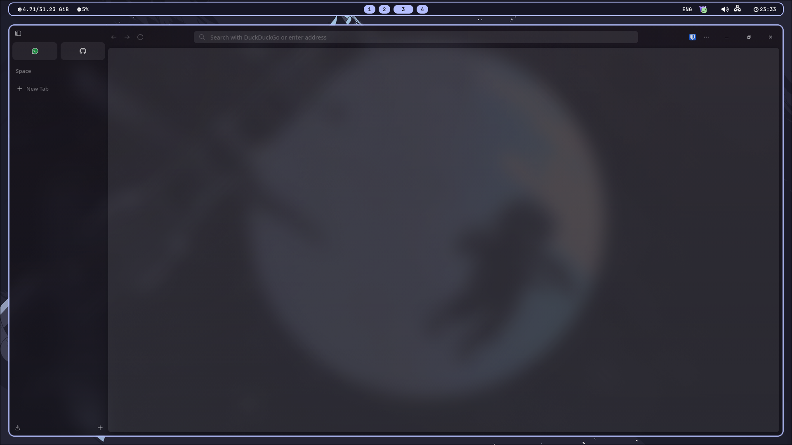

<h1 align="center"> :herb: Sakuyma hyprland Rice :herb: </h1>

<h1 align="left"> :blue_book: About</h1> 

 

 - OS: [**`Arch Linux`**](https://archlinux.org/)
 - WM: [**`Hyprland`**](https://github.com/hyprwm/Hyprland)
 - Bar: [**`Waybar`**](https://github.com/Alexays/Waybar)
 - Terminal: [**`Alacritty`**](https://github.com/alacritty/alacritty)
 - App Launcher: [**`Rofi`**](https://github.com/davatorium/rofi)
 - Notify Daemon: [**`Dunst`**](https://github.com/dunst-project/dunst)
 - Shell: [**`Zsh`**](https://github.com/zsh-users/zsh)

 
## 🖼️ Gallery

